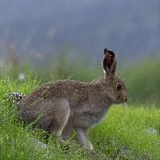

# PyTorch Deep Image Prior

An implementation of image reconstruction methods from [Deep Image Prior (Ulyanov et al., 2017)](https://arxiv.org/abs/1711.10925) in PyTorch. 

The point of the paper is to execute some common image manipulation tasks using neural networks untrained on data prior to use.

Architectures differ from those used in the actual paper. The authors use some specific networks for specific tasks. This repo uses a couple of alternative architectures to produce similar results. One where upsampling is done on the basis of pixel shuffling, and the other using transposed convolutions. Pixel shuffling results in some hotspots that do not disappear with further training.

## Requirements

Python3 with PyTorch, torchvision and NumPy. CUDA and cuDNN are optional (settable within the script in a self-explanatory way) but strongly recommended.

## To use

It's relatively easy to play around with the settings from within the scripts. To reproduce the results in the repo, do the following.

Make a directory to hold the network output:
```bash
mkdir output
```

Generate output images with:
```bash
python3 deep_image_prior.py
```

Consolidate output images into a training gif and sample some actual data with:
```bash
python3 parse_ec2_results.py
```

## Results

Note that the images here have been downsampled for formatting sensibly in the README. Full sized samples are in the repo if you would like to have a closer look.

Training was done over 25k iterations on an Amazon GPU instance. Takes roughly an hour on 512x512 images.

### Upsampling with transposed convolutions:
Note the grid like speckles during training. These are caused by convolutional kernels overlapping with one another during upsampling.

Ground truth | Input | Output | Training
------------ | ----- | ------ | --------
|||

### Upsampling with pixel shuffling:
No speckles, however there is a hotspot (in the out of focus region towards the bunny's behind) that becomes a black spot. The appearance of these hotspots seems commonplace through both architectures, but the extra smoothness given by the convolution transpose layers repairs these more effectively.

Ground truth | Input | Output | Training
------------ | ----- | ------ | --------
|||
